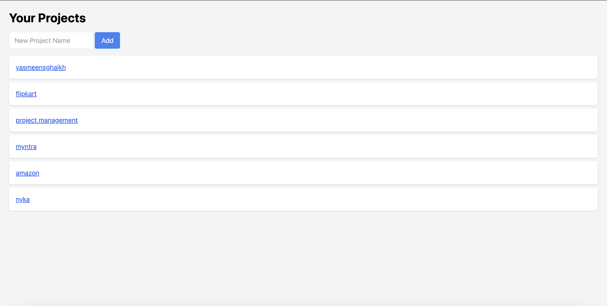

# 🧩 Project Management Tool

A simple web-based **Project Management Tool** built using **HTML**, **Tailwind CSS**, **JavaScript**, and **Firebase**.  
It lets users register, log in, create projects, add tasks with deadlines, and comment on tasks in real time.

## 📸 Screenshots

### 🧩 Dashboard Page

### ✅ Task View

## ✅ Features

- 🔐 User **Registration & Login** using Firebase Auth
- 📁 Create multiple **projects**
- 📝 Add **tasks** with title and deadline under each project
- 💬 Add **comments** to each task
- 🧠 Uses **Firebase Firestore** to store all data
- 🎨 Clean UI built with **Tailwind CSS**

## 🚀 How to Run This Project

  Clone the repository:

   git clone https://github.com/codewithyasu/ProjectManagementTool.git
   cd ProjectManagementTool

🛠️ Tech Stack
Layer	Tech Used
Frontend	HTML, Tailwind CSS
Logic	JavaScript (ES6)
Auth & DB	Firebase Auth + Firestore

📝 Project Status
✅ Completed for internship submission.
Includes all main features: Auth, Projects, Tasks, and Comments.

🙌 Made With
Made with ❤️ by [Yasmeen shaikh]
GitHub: @codewithyasu

